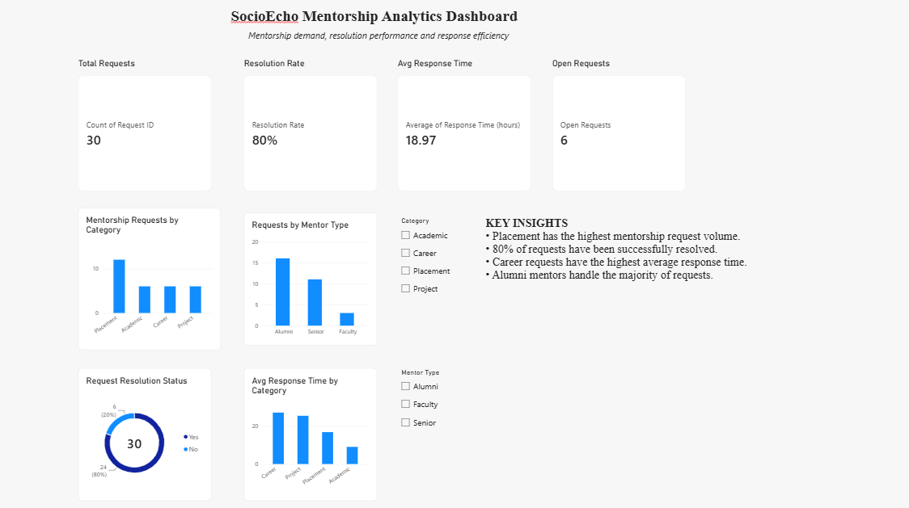

# SocioEcho Mentorship Analytics Dashboard

## Overview

An interactive Power BI dashboard developed to analyze mentorship requests, resolution performance, mentor demand, and response efficiency for the SocioEcho platform.

The dashboard transforms mentorship request data into clear business KPIs and visual insights to support data-driven decision-making.

> **Note:** The dataset used in this project is simulated and intended for analytical and portfolio demonstration purposes.

## Objectives

- Analyze mentorship request volume by category
- Understand demand across different mentor types
- Track request resolution performance
- Measure average response time
- Identify operational trends and potential improvement areas
- Present business insights through an interactive dashboard

## Key Performance Indicators

| KPI | Value |
|---|---:|
| Total Mentorship Requests | 30 |
| Resolution Rate | 80% |
| Average Response Time | 18.97 hours |
| Open Requests | 6 |

## Dashboard Features

- KPI cards for key operational metrics
- Mentorship requests by category
- Requests by mentor type
- Resolved vs. unresolved request analysis
- Average response time by category
- Interactive Category slicer
- Interactive Mentor Type slicer
- Business insights section
- DAX-based calculated measures

## Key Insights

- **Placement** has the highest mentorship request volume.
- **80%** of mentorship requests have been resolved.
- **Career** requests have the highest average response time.
- **Alumni** mentors handle the majority of mentorship requests.

## Tools & Technologies

- **Power BI Desktop**
- **DAX**
- **Data Analysis**
- **Data Visualization**

## Project Structure

```text
SocioEcho-Mentorship-Analytics/
│
├── dataset/
│   └── socioecho_mentorship_requests.csv
│
├── dashboard/
│   └── SocioEcho_Mentorship_Analytics_Dashboard.pbix
│
├── screenshots/
│   └── dashboard.png
│
└── README.md
```

## DAX Measures

### Resolution Rate

```DAX
Resolution Rate =
DIVIDE(
    CALCULATE(
        COUNTROWS('socioecho_mentorship_requests_simulated'),
        'socioecho_mentorship_requests_simulated'[Resolved] = "Yes"
    ),
    COUNTROWS('socioecho_mentorship_requests_simulated')
)
```

### Open Requests

```DAX
Open Requests =
CALCULATE(
    COUNTROWS('socioecho_mentorship_requests_simulated'),
    'socioecho_mentorship_requests_simulated'[Resolved] = "No"
)
```

## Dashboard Preview

Add the exported dashboard screenshot to the `screenshots` folder and name it:

```text
dashboard.png
```

Then the preview will appear here:



## Disclaimer

This project is a portfolio demonstration created using a simulated dataset. It does not represent real SocioEcho users, mentors, requests, or operational performance.

## Author

**Vishnu K S**

B.Tech Computer Science & Engineering
